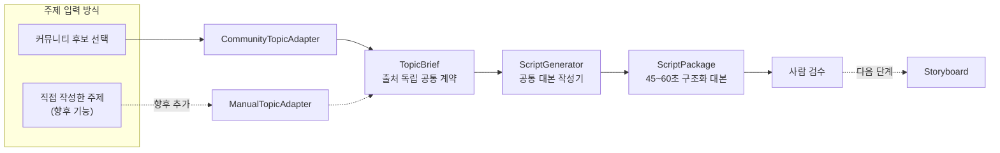

# 쇼츠 제작 시스템 아키텍처 방향

## 문서 상태

- 상태: 대본 작성 단계 반영
- 목적: 현재 구현을 설명하고, 이후 쇼츠 제작 기능을 확장할 때 지켜야 할 모듈 경계와 판단 기준을 기록한다.
- 범위: 주제 선정부터 영상 출력까지의 목표 구조를 다룬다. 현재 구현되지 않은 기능은 구현 완료로 간주하지 않는다.

## 1. 현재 시스템

현재 프로그램은 DCInside 게시물을 대상으로 후보 선정과 선택 후보 대본 작성을 각각 실행하는 동기식 배치 CLI다.

```text
Codex 실행 환경 점검
→ 갤러리 목록 및 게시물 본문 순차 수집
→ 규칙 기반 후보 필터링
→ Codex를 통한 최종 후보 일괄 평가
→ JSON 및 HTML 보고서 생성
```

사람이 후보 보고서에서 제작할 순위를 선택한 뒤에는 별도 명령으로 다음 흐름을 실행한다.

```text
선택 후보와 원문 검증
→ 커뮤니티 후보를 TopicBrief로 변환
→ Codex를 통한 45~60초 구조화 대본 작성
→ ScriptPackage JSON 및 HTML 보고서 생성
→ 사람 검수
```

갤러리, 목록 페이지, 게시물 본문 요청은 모두 순차적으로 처리한다. 애플리케이션 내부에 비동기 실행, 스레드 풀, 프로세스 풀은 없다. Codex에는 규칙 후보 전체를 한 번에 전달하지만, 애플리케이션은 단일 Codex 프로세스가 종료될 때까지 기다린다.

현재 단계의 책임은 **주제 선정, 선택한 주제의 대본 작성, 사람의 검토를 위한 결과 제공**까지다. 이미지, 음성, 영상은 아직 만들지 않는다.

## 2. 목표와 설계 동기

장기적으로 다음 흐름을 지원한다.

```text
주제 선정
→ 대본 작성
→ 장면 설계
→ 이미지·음성 등 에셋 생성
→ 자막·영상 합성
→ 검수 및 최종 출력
```

쇼츠는 유행, 장르, 플랫폼 표현 방식이 빠르게 바뀐다. 특정 커뮤니티나 특정 이미지 스타일을 전체 시스템에 직접 결합하면 새로운 장르를 추가할 때 여러 단계를 함께 수정해야 한다. 따라서 변화 이유와 변화 속도가 다른 기능을 모듈로 분리하고, 안정적인 데이터 계약으로 연결한다.

초기에는 각 모듈을 별도 서버나 프로세스로 배포하지 않는다. 하나의 저장소와 실행 프로그램 안에서 경계를 유지하는 **모듈형 모놀리스**를 기본 구조로 삼는다. 실제 운영상 독립 배포가 필요해질 때만 서비스 분리를 검토한다.

## 3. 설계 원칙

1. **교체 가능한 구현**: 장르별 수집기, 선정 정책, 대본 형식, 이미지 스타일과 렌더링 방식을 핵심 파이프라인을 수정하지 않고 바꿀 수 있어야 한다.
2. **안정적인 계약**: 모듈은 내부 구현이 아니라 명시된 입력·출력 모델로 연결한다.
3. **정책과 실행 분리**: 콘텐츠 장르와 표현 규칙은 콘텐츠 프로필에 두고, 파이프라인은 선택된 모듈을 실행하는 역할만 맡는다.
4. **출처의 연속성**: 원문 출처, 확인된 사실, 불확실성, 위험 정보가 주제 선정 이후 단계에서도 사라지지 않게 전달한다.
5. **비용 이전 검토**: 이미지·음성·영상처럼 비용이 큰 작업 전에 사람이 주제와 대본을 승인할 수 있어야 한다.
6. **필요가 확인된 뒤 최적화**: 현재의 순차 배치 실행을 기본으로 유지하고, 실행 시간이 실제 병목이 될 때 제한된 병렬 처리를 도입한다.

## 4. 목표 모듈 경계

### 4.1 주제 선정

여러 출처에서 소재를 가져와 장르별 기준으로 후보를 평가한다.

- 출처 예시: 커뮤니티, 과학 자료, 갈등 사연, 최신 전자제품 소식
- 교체 대상: 출처 어댑터, 필터, 점수 정책, 최종 선정기
- 출력: 후보 평가 결과. 사람이 후보를 선택하면 입력 어댑터가 `TopicBrief`로 변환한다.

현재 DCInside 수집기, 규칙 필터, Codex 평가기는 이 모듈의 첫 번째 구현으로 본다. 커뮤니티 전용 코드의 경계는 `CommunityTopicAdapter`까지이며, 이후 다른 출처를 추가할 때 기존 DCInside 코드를 일반화하기보다 `TopicBrief`를 만드는 새 어댑터를 추가한다.

### 4.2 대본 작성

승인된 `TopicBrief`를 목표 길이와 장르에 맞는 쇼츠 대본으로 변환한다.

- 현재 입력: 선택한 커뮤니티 후보에서 변환한 `TopicBrief`
- 현재 전략: 45~60초 몰입형 썰, 다섯 구간, 시청자 질문 마무리
- 향후 교체 대상: 설명형, 스토리형, 의견 유도형, 제품 뉴스형 대본 전략
- 책임: 훅, 내레이션, 화면 자막, 전개, 마무리, 예상 길이와 검수 경고
- 출력: `ScriptPackage`

`ScriptGenerator`는 DCInside, 후보 순위, 실행 폴더를 알지 못하고 `TopicBrief`만 입력받는다. 사실과 의견을 구분하고 각 구간에 원문 근거와 출처 ID를 연결한다. 대본 작성기는 새로운 사실을 임의로 확정하지 않으며 원문 위험과 불확실성을 결과에 보존한다.

### 4.3 출처 독립 대본 흐름

실선은 현재 구현, 점선은 향후 확장 경로다.



### 4.4 장면 설계

대본을 실제 제작 가능한 장면 단위로 나눈다. 대본과 이미지 생성기를 직접 연결하지 않고 이 경계를 두어 이미지 모델이나 영상 편집기를 교체하기 쉽게 한다.

- 책임: 장면 순서, 시간, 내레이션 구간, 화면 자막, 시각 설명
- 출력: `Storyboard`

### 4.5 에셋 생성

스토리보드를 기반으로 영상에 사용할 재료를 만든다.

- 이미지: 사진풍, 웹툰풍, 인포그래픽, 제품 중심 등 교체 가능한 스타일
- 음성: 내레이션 음성 및 장면별 타이밍
- 향후 후보: 배경음악, 효과음, 짧은 영상 클립
- 출력: `AssetBundle`

이미지 스타일은 생성 코드에 장르별 조건문으로 넣지 않고 콘텐츠 프로필 또는 이미지 전략으로 선택한다.

### 4.6 영상 제작

스토리보드와 생성된 에셋을 조합해 최종 영상을 만든다. 초기에는 하나의 모듈로 시작하고, 복잡도가 확인되면 다음 책임으로 세분화한다.

- 타임라인 구성
- 이미지·클립 배치 및 전환 효과
- 음성 정렬과 오디오 믹싱
- 자막 생성 및 배치
- 렌더링과 화면 비율·길이 검사
- 출력 파일과 제작 내역 생성

출력은 `RenderResult`이며, 영상 파일뿐 아니라 어떤 입력과 설정으로 만들었는지 추적할 수 있는 제작 내역을 포함한다.

### 4.7 검수

사람의 승인과 자동 검사를 함께 다룬다.

- 권장 승인 지점: 주제 선정 후, 대본 작성 후, 최종 영상 생성 후
- 자동 검사 후보: 영상 길이, 화면 비율, 자막 영역, 무음 구간, 누락 에셋, 위험 표시
- 승인·반려 사유는 향후 선정 및 생성 품질 개선에 사용할 수 있도록 보존한다.

## 5. 모듈 간 데이터 계약

`TopicBrief`와 `ScriptPackage`의 현재 필드는 JSON Schema와 Python 모델로 고정되어 있다. 이후 계약도 같은 방식으로 버전을 명시한다.

| 계약 | 핵심 내용 |
| --- | --- |
| `TopicBrief` | 계약 버전, 출처 종류, 제목, 원문 자료, 쇼츠 각도, 대상 시청자, 훅 후보, 출처 목록, 위험과 불확실성, 선택적 provenance |
| `ScriptPackage` | 주제 ID, 대본 제목과 스타일, 5개 내레이션·자막 구간, 45~60초 예상 길이, 구간별 출처 연결, 검토 경고 |
| `Storyboard` | 장면 ID와 순서, 시작·종료 시간, 내레이션 구간, 화면 자막, 시각 설명, 필요한 에셋 종류 |
| `AssetBundle` | 장면별 이미지·클립·음성 경로, 생성 방식과 설정, 사용 권한 또는 출처 정보, 실패·대체 상태 |
| `RenderResult` | 최종 영상 경로, 제작 내역, 사용한 프로필과 계약 버전, 자동 검사 결과, 경고 |

계약에는 버전을 둔다. 저장된 중간 결과를 나중에 다시 사용할 수 있도록 각 실행의 입력, 출력, 프로필 ID와 버전을 함께 기록한다.

## 6. 콘텐츠 프로필

장르는 주제 선정에만 영향을 주지 않는다. 대본의 말투, 이미지 스타일, 음성, 자막 속도와 편집 방식도 함께 달라질 수 있다. 이를 여러 모듈에 흩어진 조건문으로 처리하지 않고 `ContentProfile`로 묶는다.

예시:

```yaml
id: science_explainer
topic_selector: science_sources
script_strategy: concise_explainer
visual_strategy: infographic
voice_preset: calm_narration
render_preset: readable_caption
```

```yaml
id: community_conflict
topic_selector: dcinside_conflict
script_strategy: audience_question
visual_strategy: chat_comic
voice_preset: energetic_narration
render_preset: fast_caption
```

오케스트레이터는 프로필을 읽어 각 단계의 구현과 설정을 조합한다. 새 장르는 가능한 한 새 프로필과 필요한 전략 구현을 추가하여 지원하고, 공통 실행 흐름에는 장르별 분기를 추가하지 않는다.

## 7. 실행과 병렬 처리 방향

하나의 쇼츠 작업은 기본적으로 앞 단계의 결과가 다음 단계의 입력이므로 단계 간에는 순서가 있다. 초기 실행 모델은 현재와 같은 동기식 배치를 유지한다.

병렬 처리는 모듈 경계를 바꾸지 않고 내부 최적화로 도입한다.

- 수집: 외부 사이트의 요청 제한을 지키는 제한된 동시성만 검토
- 이미지·음성 생성: 서로 독립적인 장면 단위 병렬 처리 가능
- 렌더링: 여러 승인된 쇼츠 작업을 독립적으로 처리 가능

병렬화 여부가 데이터 계약이나 콘텐츠 프로필에 드러나지 않도록 한다. 외부 서비스의 제한, 비용, 실패 재시도와 결과 순서 보장이 먼저 설계되어야 한다.

## 8. 단계적 확장 순서

1. 현재 DCInside 주제 선정 기능을 안정화한다.
2. 선택한 커뮤니티 후보를 `TopicBrief` 계약으로 변환한다. (완료)
3. 출처 독립 대본 작성 모듈과 대본 검수 보고서를 추가한다. (완료)
4. 직접 작성한 주제를 `TopicBrief`로 불러오는 어댑터를 추가한다.
5. `Storyboard` 계약과 장면 설계 모듈을 추가한다.
6. 이미지 생성 전략 하나와 수동 또는 단순 렌더링 경로를 연결한다.
7. 음성, 자막, 영상 합성 및 최종 검수를 추가한다.
8. 두 번째 콘텐츠 프로필을 구현해 실제로 모듈 교체가 쉬운지 검증한다.
9. 측정된 병목과 운영 요구에 따라 병렬 처리, 작업 큐, 데이터베이스 또는 서비스 분리를 검토한다.

## 9. 현재 결정하지 않는 사항

다음은 실제 제작 모듈을 실험한 뒤 결정한다.

- 이미지, 음성 및 영상 생성 도구와 공급자
- 영상 제작 모듈의 최종 세부 분리 수준
- 자동 게시 여부와 게시 플랫폼 연동
- 데이터베이스, 작업 큐, 웹 관리 화면 도입
- 클라우드 실행 또는 별도 서비스 배포
- 장면 및 여러 쇼츠 작업의 동시 처리 개수

이 항목들은 확장 가능성을 열어두되, 필요가 확인되기 전에는 현재 CLI와 순차 배치 구조를 복잡하게 만들지 않는다.
